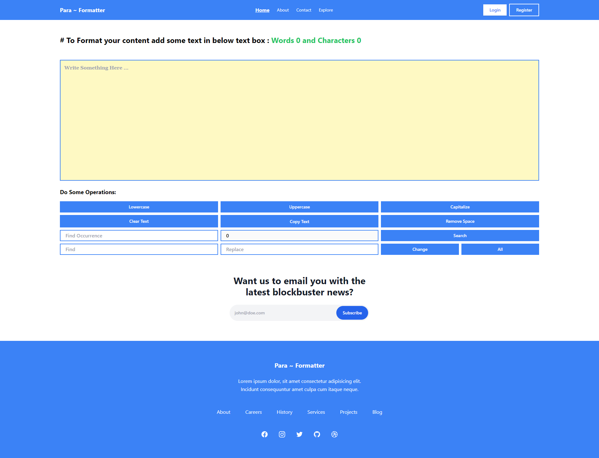

# Para Formatter

## [Visit Website Here..](https://para-formatter.vercel.app/)

## Project Overview
Para Formatter is a versatile web application that facilitates various text editing tasks. This project is built using ReactJS, Tailwind CSS, and the Vite framework, combining modern technologies to provide users with a seamless text editing experience.

## Features

- **Text Transformation:** Easily convert text to lowercase, uppercase, or capitalize it according to your needs.
- **Clipboard Integration:** Copy edited text directly to the clipboard, enhancing user efficiency.
- **Word Replacement:** Replace specific words within the text effortlessly, aiding in proofreading and editing.
- **Word and Character Count:** Instantly obtain word and character counts for precise content analysis.
- **Word Search:** Quickly locate specific words within the text to enhance readability and comprehension.

## Previews

## Installation

1. Clone this repository: `git clone https://github.com/ABHISHEK-SIN-GH/Para-Formatter.git`
2. Navigate to the project directory: `cd para-formatter`
3. Install dependencies: `npm install`
4. Start the development server: `npm run dev`

## Technologies Used

- ReactJS: Dynamic rendering and interactivity.
- Tailwind CSS: Responsive and efficient styling.
- Vite: Fast build and development tooling.

## Usage

1. Access the web app through your preferred browser.
2. Enter or paste the text you want to edit into the provided textarea.
3. Utilize the buttons and options provided to perform various text editing tasks.
4. View the edited text and copy it to the clipboard if needed.

## Contributing

Contributions are welcome! To contribute to Para Formatter, follow these steps:

1. Fork this repository.
2. Create a new branch: `git checkout -b feature/my-feature`
3. Commit your changes: `git commit -m 'Add some feature'`
4. Push to the branch: `git push origin feature/my-feature`
5. Submit a pull request.
